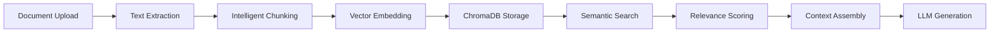
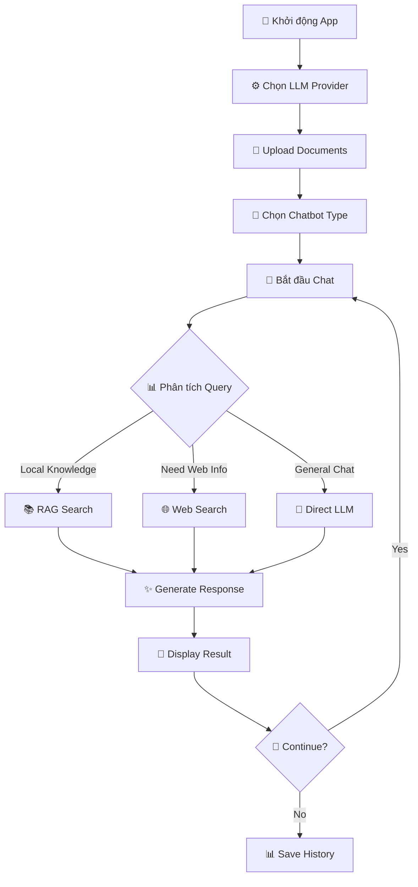

# 🚀 SoDiTEC AgentAI Module 3 - Trợ lý AI Thông minh trong Giáo dục

<div align="center">


_Trợ lý AI tiên tiến đồng hành cùng bạn trong học tập_

</div>

---

## 📋 Mục Lục

-   [🤖 Giới Thiệu](#-giới-thiệu)
-   [✨ Tính Năng Nổi Bật](#-tính-năng-nổi-bật)
-   [🏗️ Kiến Trúc Hệ Thống](#️-kiến-trúc-hệ-thống)
-   [⚡ Bắt Đầu Nhanh](#-bắt-đầu-nhanh)
-   [🔧 Cấu Hình Hệ Thống](#-cấu-hình-hệ-thống)
-   [📊 Yêu Cầu Hệ Thống](#-yêu-cầu-hệ-thống)
-   [💡 Hướng Dẫn Sử Dụng](#-hướng-dẫn-sử-dụng)
-   [❓ Thông tin](#-thông-tin)

---

## 🤖 Giới Thiệu

**SoDiTEC AgentAI Module 3** là một trơ lý AI hỗ trợ học tập được phát triển bởi CLB SoDiTEC - SOICT HUST. Hệ thống là AI agent được xây dựng trên nền tảng LangGraph framework hiện đại, tích hợp công nghệ RAG (Retrieval-Augmented Generation), ... để mang lại trải nghiệm tương tác AI thông minh và chính xác.

### 🎯 Mục Tiêu Dự Án

-   **Tăng cường độ chính xác**: Sử dụng RAG để cung cấp thông tin từ nguồn dữ liệu đáng tin cậy
-   **Đa dạng hóa chức năng**: Hỗ trợ nhiều loại chatbot cho các mục đích khác nhau
-   **Tích hợp thông minh**: Kết hợp AI, web search và xử lý tài liệu
-   **Giao diện thân thiện**: UI trực quan, dễ sử dụng cho người dùng cuối

---

## ✨ Tính Năng Nổi Bật

### 🧠 Đa Dạng Loại Chatbot

<table>
<tr>
<td width="25%">

**🤖 Basic Chatbot**

-   Chatbot cơ bản với LLM
-   Hỗ trợ trò chuyện tự nhiên
-   Phản hồi nhanh và chính xác

</td>
<td width="25%">

**📚 RAG Chatbot**

-   Tích hợp vector database
-   Knowledge retrieval thông minh
-   Trả lời dựa trên tài liệu

</td>
<td width="25%">

**🔧 Tool-enabled Chatbot**

-   Tích hợp web search
-   Sử dụng external tools
-   Thông tin real-time

</td>
<td width="25%">

**📰 AI News Bot**

-   Thu thập tin tức AI tự động
-   Tóm tắt thông tin
-   Cập nhật theo thời gian

</td>
</tr>
</table>

### 📄 Xử Lý Tài Liệu Thông Minh

<div align="center">

**✅ PDF** - **✅ DOCX** - **✅ TXT**

</div>

**🔍 Chunking Strategy:**

-   **Intelligent Segmentation**: Tự động chia nhỏ documents với overlap
-   **Semantic Boundaries**: Giữ nguyên ngữ cảnh và ý nghĩa
-   **Configurable Size**: Tùy chỉnh kích thước chunk theo nhu cầu

### 🏢 RAG Engine Tiên Tiến



**Core Features:**

-   **🔍 Semantic Search**: Vector-based document retrieval với cosine similarity
-   **⚖️ Relevance Assessment**: LLM-powered scoring để đảm bảo độ chính xác
-   **🔄 Hybrid Retrieval**: Kết hợp local knowledge và web search
-   **📚 Document Management**: Version control và history tracking

### 🌐 Tích Hợp Web & External APIs

**Tavily Search Integration:**

-   ✅ Real-time web search capabilities
-   ✅ High-quality search results filtering
-   ✅ Source credibility verification
-   ✅ Automatic citation generation

**API Ecosystem:**

-   **Groq API**: Ultra-fast LLM inference
-   **OpenAI API**: Advanced reasoning capabilities
-   **Tavily API**: Professional web search
-   **Custom APIs**: Extensible integration framework

### 🎨 Giao Diện Người Dùng (Streamlit UI)

<div align="center">

| Tính Năng                  | Mô Tả                          | Trạng Thái |
| -------------------------- | ------------------------------ | ---------- |
| **� Responsive Design**    | Tương thích đa thiết bị        | ✅         |
| **📁 File Manager**        | Upload, view, delete documents | ✅         |
| **⚙️ Config Panel**        | Tùy chỉnh LLM parameters       | ✅         |
| **💬 Chat Interface**      | Real-time conversation         | ✅         |
| **📊 Analytics Dashboard** | Usage statistics               | 🚧         |

</div>

---

## 🏗️ Kiến Trúc Hệ Thống

### 📐 System Architecture Overview

```
┌─────────────────────────────────────────────────────────────────────┐
│                         STREAMLIT WEB UI                            │
│                    (Frontend & User Interface)                      │
├─────────────────────────────────────────────────────────────────────┤
│                          LANGGRAPH WORKFLOWS                        │
│                     (Orchestration & State Management)              │
│  ┌─────────────┐  ┌─────────────┐  ┌─────────────┐  ┌─────────────┐ │
│  │  BASIC      │  │  RAG        │  │  TOOL       │  │  NEWS       │ │
│  │  CHATBOT    │  │  CHATBOT    │  │  CHATBOT    │  │  AGENT      │ │
│  └─────────────┘  └─────────────┘  └─────────────┘  └─────────────┘ │
├─────────────────────────────────────────────────────────────────────┤
│                        LLM PROVIDERS                                │
│                  (Language Model Integration)                       │
│  ┌─────────────────────┐              ┌─────────────────────┐       │
│  │        GROQ         │              │       OPENAI        │       │
│  │  (Fast Inference)   │              │ (Advanced Models)   │       │
│  │  • Mixtral 8x7B     │              │  • GPT-4 Turbo      │       │
│  │  • Llama 3 70B      │              │  • GPT-3.5 Turbo    │       │
│  └─────────────────────┘              └─────────────────────┘       │
├─────────────────────────────────────────────────────────────────────┤
│                       TOOLS & VECTOR STORE                          │
│                 (Data Storage & External Services)                  │
│  ┌─────────────┐  ┌─────────────┐  ┌─────────────┐  ┌─────────────┐ │
│  │  CHROMA     │  │  AVILY      │  │  MBED       │  │  FILE       │ │
│  │  DATABASE   │  │  SEARCH     │  │  MODELS     │  │  MANAGER    │ │
│  └─────────────┘  └─────────────┘  └─────────────┘  └─────────────┘ │
└─────────────────────────────────────────────────────────────────────┘
```

### 📁 Project Structure Deep Dive

```
SoDiTEC-AgenticAI/
├── 📱 app.py                          # Main Streamlit application
├── 📋 requirements.txt                # Production dependencies
├── 🔧 requirements-dev.txt            # Development dependencies
├── 📄 README.md                       # This file
├── 🧪 tests/                          # Test suite
│   ├── unit/                          # Unit tests
│   ├── integration/                   # Integration tests
│   └── performance/                   # Performance benchmarks
├── 📁 src/                            # Source code
│   ├── 🔗 LangGraph/                  # LangGraph workflows
│   │   ├── 🎯 main.py                 # Main orchestrator
│   │   ├── 📊 graph/                  # Graph definitions
│   │   │   └── graph_builder.py       # Graph construction logic
│   │   ├── 🧠 LLMs/                   # LLM integrations
│   │   │   ├── groqllm.py             # Groq API integration
│   │   │   └── openaillm.py           # OpenAI API integration
│   │   ├── 🎭 nodes/                  # LangGraph nodes
│   │   │   ├── basic_chatbot_node.py  # Basic chat functionality
│   │   │   ├── chatbot_rag.py         # RAG implementation
│   │   │   ├── chatbot_with_Tool_node.py # Tool integration
│   │   │   └── ai_news_node.py        # News aggregation
│   │   ├── 🔄 state/                  # State management
│   │   │   └── state.py               # Graph state definitions
│   │   ├── 🛠️ tools/                  # External tools
│   │   │   └── search_tool.py         # Web search integration
│   │   ├── 🎨 ui/                     # UI components
│   │   │   ├── uiconfigfile.py        # Configuration management
│   │   │   └── streamlitui/           # Streamlit components
│   │   └── 💾 vectorstore/            # Vector database
│   │       ├── vectorstore_manager.py # ChromaDB management
│   │       ├── file_ingestion.py      # Document processing
│   │       └── Embedding_model.py     # Embedding models
└── 📰 AINews/                         # Generated news summaries
    ├── daily_summary.md
    ├── weekly_summary.md
    ├── monthly_summary.md
    └── yearly_summary.md

```

## ⚡ Bắt Đầu Nhanh

### 📋 Yêu Cầu Trước Khi Cài Đặt

-   **Operating System**: Windows 10+, macOS 10.15+, Ubuntu 18.04+
-   **Python**: Version 3.11 trở lên (khuyến nghị 3.12)
-   **Memory**: Tối thiểu 4GB RAM (khuyến nghị 8GB+)
-   **Storage**: 10GB dung lượng trống
-   **Internet**: Kết nối ổn định cho API calls

### 🚀 Hướng Dẫn Cài Đặt

#### Bước 1: Clone Repository

```bash
git clone https://github.com/soditec-soict-hust/SoDiTEC-AgenticAI.git
cd SoDiTEC-AgenticAI
```

#### Bước 2: Tạo Virtual Environment

```bash
# Tạo môi trường ảo
python -m venv venv

# Kích hoạt môi trường (Windows)
venv\Scripts\activate

# Kích hoạt môi trường (Linux/Mac)
source venv/bin/activate
```

#### Bước 3: Cài Đặt Dependencies

```bash
# Cập nhật pip
python -m pip install --upgrade pip

# Cài đặt requirements
pip install -r requirements.txt
```

#### Bước 4: Chạy Ứng Dụng

```bash
streamlit run app.py
```

🎉 **Hoàn thành!** Truy cập http://localhost:8501 để sử dụng ứng dụng.

---

## Cấu Hình Hệ Thống

### 🔑 API Keys & Credentials

#### 🚀 Groq API (Khuyến nghị - Free tier mạnh mẽ)

-   **Website**: [console.groq.com](https://console.groq.com/keys)
-   **Free tier**: 100 requests/day, inference cực nhanh
-   **Models**: Mixtral 8x7B, Llama 3 70B, Gemma 7B
-   **Đặc điểm**: Tốc độ inference nhanh nhất thị trường

#### 🔍 Tavily Search API (Cho web search)

-   **Website**: [app.tavily.com](https://app.tavily.com/home)
-   **Free tier**: 1,000 searches/tháng
-   **Tính năng**: Professional search, high-quality results
-   **Use case**: Real-time information retrieval

#### 🤖 OpenAI API (Tùy chọn - Advanced models)

-   **Website**: [platform.openai.com](https://platform.openai.com/api-keys)
-   **Pricing**: Pay-per-use, mô hình tiên tiến nhất
-   **Models**: GPT-4 Turbo, GPT-3.5 Turbo, Embeddings
-   **Ưu điểm**: Reasoning capabilities cao nhất

### ⚙️ Configuration Files

#### 📄 uiconfigfile.ini

```ini
[DEFAULT]
PAGE_TITLE = LangGraph: Build Stateful Agentic AI graph
LLM_OPTIONS = Groq, OpenAI
USECASE_OPTIONS = Basic Chatbot, Chatbot With WebTool, AI News, Chatbot with RAG
GROQ_MODEL_OPTIONS = meta-llama/llama-4-maverick-17b-128e-instruct, gemma2-9b-it
OPENAI_MODEL_OPTIONS = gpt-4o-mini
EMBEDDING_MODEL_OPTIONS = sentence-transformers/all-MiniLM-L6-v2
```

## 📊 Yêu Cầu Hệ Thống

### 💻 Minimum Requirements

| Component   | Requirement                              | Note                    |
| ----------- | ---------------------------------------- | ----------------------- |
| **OS**      | Windows 10+, macOS 10.15+, Ubuntu 18.04+ | 64-bit required         |
| **Python**  | 3.11+                                    | Khuyến nghị 3.12        |
| **RAM**     | 4GB                                      | 8GB cho performance tốt |
| **Storage** | 5GB free space                           | SSD khuyến nghị         |
| **Network** | Stable internet                          | Cho API calls           |

### 🚀 Recommended Specifications

| Component   | Recommendation        | Performance Benefit        |
| ----------- | --------------------- | -------------------------- |
| **CPU**     | Intel i5/AMD Ryzen 5+ | Faster document processing |
| **RAM**     | 16GB+                 | Large document handling    |
| **Storage** | 20GB+ SSD             | Quick app startup          |
| **GPU**     | NVIDIA RTX (optional) | Local model acceleration   |
| **Network** | Fiber/Broadband       | Real-time search           |

### 🐍 Python Dependencies

```txt
# Core framework
streamlit>=1.28.0
langchain>=0.1.0
langgraph>=0.0.40
langchain-community>=0.0.20

# Vector store & embeddings
chromadb>=0.4.15
sentence-transformers>=2.2.2

# LLM providers
langchain-groq>=0.1.0
langchain-openai>=0.1.0

# Document processing
pypdf>=3.17.0
python-docx>=0.8.11
python-dotenv>=1.0.0

# Web search
tavily-python>=0.3.0

# UI components
plotly>=5.17.0
pandas>=2.1.0
```

---

## 💡 Hướng Dẫn Sử Dụng

### � Workflow Tổng Quan



### 📚 Chi Tiết Các Loại Chatbot

#### 1️⃣ Basic Chatbot

**Mục đích**: Trò chuyện tổng quát với AI

**Cách sử dụng**:

```
👤 User: "Giải thích về machine learning"
🤖 Bot: [Sử dụng LLM để tạo explanation chi tiết]

👤 User: "Viết code Python để sort array"
🤖 Bot: [Generate code với explanation]
```

**Ưu điểm**:

-   ⚡ Phản hồi nhanh
-   🧠 Kiến thức rộng
-   💡 Creative responses

#### 2️⃣ RAG Chatbot

**Mục đích**: Trả lời dựa trên tài liệu đã upload

**Workflow**:

1. **📤 Upload Documents**: PDF, DOCX, TXT files
2. **🔧 Processing**: Automatic chunking và embedding
3. **💬 Query**: Đặt câu hỏi về nội dung documents
4. **🔍 Retrieval**: System tìm relevant chunks
5. **✨ Generation**: Tạo answer dựa trên context

**Example Usage**:

```
📁 Upload: "company_handbook.pdf"

👤 User: "Chính sách nghỉ phép của công ty như thế nào?"
🤖 Bot: "Theo tài liệu bạn cung cấp, chính sách nghỉ phép:
       • Nhân viên mới: 12 ngày/năm
       • Nhân viên > 2 năm: 15 ngày/năm
       • Nghỉ phép cần đăng ký trước 1 tuần

       [Source: company_handbook.pdf, page 23]"
```

#### 3️⃣ Tool-enabled Chatbot

**Mục đích**: Kết hợp local knowledge + web search

**Smart Routing Logic**:

```python
if query_type == "specific_document_question":
    → Use RAG Search
elif query_type == "current_events" or "real_time_info":
    → Use Web Search
elif query_type == "complex_research":
    → Use Both RAG + Web
else:
    → Use Direct LLM
```

**Example Scenarios**:

```
👤 User: "Tin tức AI mới nhất tuần này"
🤖 Bot: [Web Search] → [Aggregate results] → [Summarize]

👤 User: "So sánh thông tin trong tài liệu với xu hướng thị trường hiện tại"
🤖 Bot: [RAG Search] + [Web Search] → [Cross-reference] → [Analysis]
```

#### 4️⃣ AI News Agent

**Mục đích**: Tự động theo dõi và tóm tắt tin tức AI

**Features**:

-   🕐 **Time-based Summaries**: Daily, Weekly, Monthly, Yearly
-   🔍 **Smart Filtering**: Chỉ tin tức AI relevant và chất lượng
-   💾 **Auto-save**: Lưu summaries vào markdown files
-   📊 **Trend Analysis**: Phân tích xu hướng theo thời gian

**Usage**:

```
👤 User: Chọn "Weekly Summary"
🤖 Bot:
"📰 AI News Summary - Tuần 37/2025

🔥 Highlights:
• OpenAI ra mắt GPT-5 với khả năng reasoning mới
• Google phát triển AI chip thế hệ mới
• Meta open-source Llama 3.1 405B

📈 Trends:
• Tăng trưởng 40% investment vào AI startups
• Edge AI devices tăng mạnh
• AI safety regulations được thảo luận nhiều

💡 Analysis: [Detailed trend analysis...]"
```

## ❓ Thông tin

### 📖 Khoá học

Nền tảng học tập hiện đại: [Học Bách khoa](https://hocbk.daotao.ai/)

### 📞 Liên hệ

**-- Connecting Learners, Innovating Education --**

-   ☎️Hotline: [0336626401](tel:0336626401) (Nguyễn Đình Dương)
-   📧Email: [soditec.hust@gmail.com](mailto:soditec.hust@gmail.com)
-   🌐Page: [SoDiTEC - SOICT HUST](https://www.facebook.com/soditec.soict.hust)
-   📱Tiktok: [@soditec.soict.hust](https://www.tiktok.com/@soditec.soict.hust)
